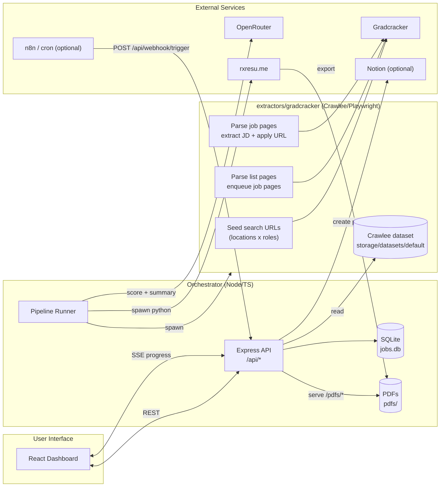

# Job Ops

Automated job discovery -> AI suitability scoring -> tailored resume PDFs -> a dashboard to review/apply (with optional Notion sync).

## How it works (pipeline)

1. **Crawl**: `extractors/gradcracker` (Crawlee + Playwright + Camoufox) visits Gradcracker search pages, opens each job page, extracts structured fields + the job description, and captures the real application URL by clicking the apply button (skipped for already-known jobs).
2. **Import + dedupe**: `orchestrator` reads the Crawlee dataset (`extractors/gradcracker/storage/datasets/default/*.json`) and inserts new jobs into SQLite (`jobs.job_url` is unique).
3. **Score**: `orchestrator` scores up to 50 unprocessed jobs via OpenRouter (cached as `suitabilityScore`/`suitabilityReason`).
4. **Select**: take the top `N` jobs above `minSuitabilityScore`.
5. **Process**: for each selected job:
   - generate a tailored resume summary via OpenRouter (stored on the job)
   - generate a PDF by injecting the summary into `resume-generator/base.json`, writing a temp resume JSON, then running `resume-generator/rxresume_automation.py` (Playwright automates `rxresu.me` import -> export)
6. **Review/apply**: the React dashboard shows job status, score, links, and PDFs; clicking `Mark Applied` optionally creates a Notion page.

Live progress is streamed to the UI via Server-Sent Events at `GET /api/pipeline/progress` (the crawler emits stdout lines prefixed with `JOBOPS_PROGRESS`; the orchestrator forwards them).

## Architecture (Mermaid)



## Repo layout

```
job-ops/
  orchestrator/                 # Express API + React dashboard + pipeline
    src/server/                 # API routes, pipeline, DB, services
    src/client/                 # UI (polls jobs, listens to SSE progress)
    src/shared/                 # shared types (Job, PipelineRun, etc.)
  extractors/gradcracker/       # Crawlee crawler (Gradcracker)
  extractors/jobspy/            # JobSpy wrapper (Indeed/LinkedIn/etc)
  resume-generator/             # Python Playwright automation for rxresu.me
    base.json                   # your exported base resume (template)
  data/                         # persisted runtime artifacts (Docker default)
    jobs.db                     # SQLite database
    pdfs/                       # generated PDFs (resume_<jobId>.pdf)
  docker-compose.yml            # single-container deployment
  Dockerfile                    # builds orchestrator + installs browsers
```

## Data model (SQLite)

- `jobs`
  - from crawl: `title`, `employer`, `jobUrl`, `applicationLink`, `deadline`, `salary`, `location`, `jobDescription`, etc.
  - enrichments: `status` (`discovered` -> `processing` -> `ready` -> `applied`/`rejected`), `suitabilityScore`, `suitabilityReason`, `tailoredSummary`, `pdfPath`, `notionPageId`
- `pipeline_runs`: audit log of runs (`running`/`completed`/`failed`, counts, error)

## Running (Docker)

1. Create `.env` at repo root (`cp .env.example .env`) and set:
   - `OPENROUTER_API_KEY`
   - `RXRESUME_EMAIL`, `RXRESUME_PASSWORD`
   - optional: `NOTION_API_KEY`, `NOTION_DATABASE_ID`, `WEBHOOK_SECRET`
2. Put your exported RXResume JSON at `resume-generator/base.json`.
3. Start: `docker compose up -d --build`
4. Open:
   - Dashboard/UI: `http://localhost:3005`
   - API: `http://localhost:3005/api`
   - Health: `http://localhost:3005/health`

Persistent data lives in `./data` (bind-mounted into the container).

## Running (local dev)

Prereqs: Node 20+, Python 3.10+, Playwright browsers (Firefox).

Install Node deps (both packages):

```bash
cd orchestrator && npm install
cd ../extractors/gradcracker && npm install
```

Configure the orchestrator env + DB:

```bash
cd ../orchestrator
cp .env.example .env
npm run db:migrate
npm run dev
```

Set up the resume generator (used for PDF export):

```bash
cd ../resume-generator
python -m venv .venv
# Windows PowerShell:
.\.venv\Scripts\Activate.ps1
# macOS/Linux:
# source .venv/bin/activate
pip install playwright
python -m playwright install firefox
```

If you're on Windows, set `PYTHON_PATH` in `orchestrator/.env` to your venv python (e.g. `..\resume-generator\.venv\Scripts\python.exe`) or use Docker/WSL.

Dev URLs:
- API: `http://localhost:3001/api`
- UI (Vite): `http://localhost:5173`

## Key endpoints

- Jobs: `GET /api/jobs`, `POST /api/jobs/:id/process`, `POST /api/jobs/:id/apply`, `POST /api/jobs/:id/reject`, `POST /api/jobs/process-discovered`
- Pipeline: `POST /api/pipeline/run`, `GET /api/pipeline/status`, `GET /api/pipeline/progress` (SSE)
- Webhook: `POST /api/webhook/trigger` (optional auth via `WEBHOOK_SECRET`)
- Ops: `DELETE /api/database` (wipes DB)

## Notes / sharp edges

- **Crawl targets**: edit `extractors/gradcracker/src/main.ts` to change the Gradcracker location/role matrix.
- **Notion sync is schema-dependent**: `orchestrator/src/server/services/notion.ts` assumes property names; adjust to match your Notion database.
- **Pipeline config knobs**: `POST /api/pipeline/run` accepts `{ topN, minSuitabilityScore }`; `PIPELINE_TOP_N`/`PIPELINE_MIN_SCORE` are used by `npm run pipeline:run` (CLI runner).
- **Anti-bot reality**: crawling is headless + "humanized", but sites can still block; expect occasional flakiness.

## License

MIT
